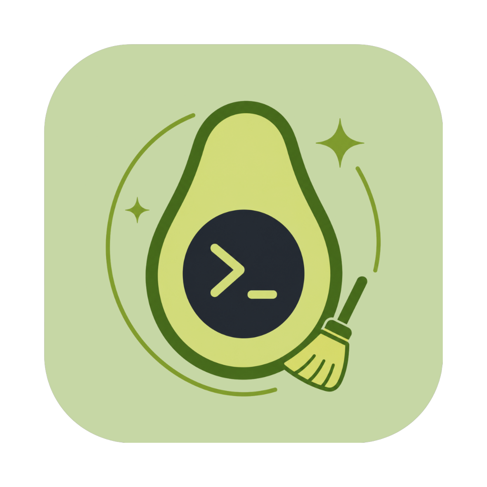

<table>
<tr>
<td></td>
<td>

# GuacSweep

**A lean, transparent, and non-destructive macOS CLI cleanup tool**

</td>
</tr>
</table>

GuacSweep is a simple, dependency-free Bash script that cleans up the same junk as CleanMyMac X, but without the subscription, closed source, bloat, or binaries. It clears caches, logs, recent items, history traces, trims Time Machine snapshots, and finds orphaned app data from old apps. Files go to Trash first.

[](LICENSE)
[]()
[]()
[]()

[](https://buymeacoffee.com/avocadoattack)
[](https://ko-fi.com/avocadoattack)


*(Demo GIF coming soon)*

---

## 🔍 What it does

GuacSweep uses a simple numbered menu—one action at a time. Choose from ten options: seven safe, reversible cleanups; one scan to review orphaned app data; one shortcut to run all safe actions; and one irreversible option.

No Homebrew, toolchains, or third-party libraries needed. GuacSweep is plain POSIX-ish Bash, compatible with the ancient `bash 3.2`, which Apple still ships by default on every Mac. It runs as soon as you `chmod +x`.

---

## 📦 Installation

### Option A: Clone the repo

Recommended if you want to read the whole thing first, which is the point:

```bash
git clone https://github.com/avocadoattack/GuacSweep.git
cd GuacSweep
chmod +x guacsweep.sh
```

### Option B: Download just the script

With `curl`:

```bash
curl -o guacsweep.sh https://raw.githubusercontent.com/avocadoattack/GuacSweep/master/guacsweep.sh
chmod +x guacsweep.sh
```

With `wget`:

```bash
wget https://raw.githubusercontent.com/avocadoattack/GuacSweep/master/guacsweep.sh
chmod +x guacsweep.sh
```

> [!IMPORTANT]
> The commands above just download and make the script executable; they don’t run it. Review the script yourself before running it (`cat guacsweep.sh`). That’s why GuacSweep is plain bash, not a compiled binary.

### Run it

```bash
./guacsweep.sh
```

### Optional: Install it globally

So you can just type `guacsweep` from *any* Terminal window instead of `./guacsweep.sh`:

```bash
curl -o /usr/local/bin/guacsweep https://raw.githubusercontent.com/avocadoattack/GuacSweep/master/guacsweep.sh
chmod +x /usr/local/bin/guacsweep
```

> If `/usr/local/bin` isn't writable on your system, prefix both commands with `sudo`. Transparency applies here, too: take a look at `/usr/local/bin/guacsweep` before typing `guacsweep` for the first time.

### Updating

There's no package manager yet, so updating just means re-running whichever download command you used above. It overwrites the old copy with the current version.

---

## 🌱 Why I built this

I owned a CleanMyMac X license but used only a few features. Rather than pay for a subscription, I wanted a free tool with no strings attached that did the basics.

Two excellent open-source alternatives exist: [PureMac](https://github.com/momenbasel/PureMac), a native macOS uninstaller and cleaner, and [Mole](https://github.com/tw93/Mole), a command-line powerhouse with features like disk analysis and artifact cleanup. Both are well-maintained and open source. GuacSweep doesn’t aim to compete on features.

My goal was simplicity and transparency. I wanted a script you could read in full before running. PureMac is a signed app; Mole is mostly shell but includes some compiled Go code for advanced features, which means trusting the binary matches the source. With GuacSweep, what you download is the whole program; no compiled parts.

I also wanted something focused: just the essentials I use, not a full toolkit. If you need more, PureMac and Mole are both solid choices for anything GuacSweep doesn’t cover.

---

## ✨ Menu options (features)

| # | Option | What it does |
|---|---|---|
| 1 | **Delete User Junk Files (Cache + Logs)** | Clears `~/Library/Caches`, `~/Library/Logs`, and Xcode's `DerivedData` build cache, if present. All regenerate automatically. |
| 2 | **Delete System Junk Files (sudo)** | Clears `/Library/Caches`, the shared system-level cache folder. Requires sudo since it's root-owned. |
| 3 | **Delete Recent Items Lists** | Clears Apple menu Recent Documents/Applications/Servers and each app's own File > Open Recent menu. Shortcuts only, not the files themselves. |
| 4 | **Delete Terminal History** | Clears `~/.zsh_history` and `~/.bash_history`. Your currently-open terminal session keeps its own in-memory history regardless, see [Known limitations](#%EF%B8%8F-known-limitations). |
| 5 | **Delete Download History** | Clears macOS's download-quarantine metadata (source and date of downloads). Does not touch the downloaded files themselves. |
| 6 | **Flush DNS Cache** | Clears the local DNS lookup cache. Touches zero files; requires sudo. |
| 7 | **Time Machine Snapshot Thinning** | Removes local Time Machine snapshots (on-disk checkpoints for offline "Browse in Time," not your real backups). Requires sudo. |
| 8 | **Leftover Sweep Scan (orphaned app data)** | Scans `~/Library` for data left behind by apps no longer installed, matched by bundle identifier. Reports a grouped, human-readable summary; nothing moves until you explicitly select what to trash. |
| 9 | **Run Full Sweep (all safe options)** | Runs options 1 through 7 in sequence behind a single confirmation. Excludes Leftover Sweep and Empty Trash, since both need manual review. |
| 10 | **🔥 Empty Trash (Permanent Delete)** | The only irreversible action in the script. Empties `~/.Trash` and any connected external drives' Trash for good. |

---

## 📊 Comparison to similar apps

| | GuacSweep | PureMac | Mole | CleanMyMac X |
|---|---|---|---|---|
| Price | Free | Free | CLI free / GUI paid | $40+/yr |
| Open source | Yes (MIT) | Yes (MIT) | CLI only (GPL-3.0)¹ | No |
| Distribution | Plain shell script | Native macOS app | Mostly shell, partial compiled Go² | Native macOS app |
| Native Mac GUI | No | Yes | Paid | Yes |
| Fully human-readable before running³ | Yes | Partial | Partial | No |
| Telemetry-free | Yes | Yes | Yes | No |
| Subscription-free | Yes | Yes | Yes | No |
| Signed and notarized | N/A⁴ | Yes | Yes | Yes |
| App uninstaller / orphan finder | Partial⁵ | Yes | Yes | Yes |
| Trash-only (recoverable) | Yes | Yes | Partial | Partial |
| Install footprint | None, single file | App bundle in `/Applications` | Shell + compiled component, via Homebrew/script | App bundle + installer |

<sub>
¹ Mole, the CLI tool, (what's compared throughout this table) is GPL-3.0 licensed and fully open source. Mole for Mac is a separate, proprietary GUI app from the same author.<br>
² Per GitHub's own language breakdown of the repository: roughly 82% shell, 18% Go. The majority of Mole is plain shell script; a real but small part compiles down to a Go binary.<br>
³ The core differentiator this project exists for: a plain-text script you can read end to end has no gap between "the source" and "what runs," unlike anything that goes through a compile step.<br>
⁴ Code-signing and notarization satisfy Gatekeeper's checks on compiled executables. A shell script isn't in that category, so this isn't a workaround, it's a different distribution model.<br>
⁵ Leftover Sweep matches by bundle identifier and reports a reviewable summary, but stops short of PureMac's and Mole's deeper heuristics (normalized-name matching, Team ID resolution).<br>
</sub>

---

## 🛡️ Safety model

Every design decision in this script follows from one rule: **nothing is ever silently destructive.**

- **Trash-first.** Cleanup actions move files into a dated, clearly labeled folder inside `~/.Trash` rather than deleting anything directly. If something turns out to matter, drag it back out.
- **`mv`-based Trash.** Files are moved into Trash with plain `mv`, not by asking Finder to delete them via AppleScript. This avoids extra permissions and dependencies, but disables Finder’s “Put Back” shortcut. You can still drag files back manually.
- **One irreversible action.** `🔥 Empty Trash (Permanent Delete)` . It’s set apart in the menu, requires typing `EMPTY` to confirm, and shows a clear warning.
- **Confirm before anything runs.** Every action explains what it’s about to do and asks for confirmation first. Nothing fires on a stray keypress.
- **Ctrl+C always gets you out.** Hitting Ctrl+C at any prompt, including a sudo password prompt, cancels cleanly and returns you to the main menu.
- **`sudo` calls are announced first.** Three menu options and Leftover Sweep require elevated permissions. You’re told up front, and Ctrl+C cancels cleanly.

---

## ⚠️ Known limitations

- **Leftover Sweep may over/under flag.** Apps with unusual helper naming (concatenated suffixes with no separating dot, Team-ID-prefixed containers, vendors using multiple unrelated bundle-ID families for one app) or shared SDKs (e.g., Sparkle, Firebase, Bugsnag, Google Keystone) can appear as false positives or be missed.
- **System junk cleaning is conservative.** `/System/Library/Caches` and system log files (`/var/log` and friends) are skipped entirely to avoid losing access to files' diagnostic and forensic trails.
- **Finder's “Put Back” won't show.** Since Trash moves use plain `mv` rather than Finder's own delete API, restoring a trashed item means manually moving it back to its original location. See [Safety model](#%EF%B8%8F-safety-model) for why this tradeoff was made deliberately.
- **Clearing terminal history only affects the file on disk.** Your currently-open terminal session keeps its own command history in memory. For a full clean, close and reopen your terminal.
- **Primarily tested on Intel Macs.** Community testing and feedback for Apple Silicon is welcome.

---

## 🗺️ Roadmap

- [ ] Homebrew tap (`avocadoattack/homebrew-tap`), so installation becomes `brew install avocadoattack/tap/guacsweep`
- [ ] Continued refinement of Leftover Sweep's matching heuristics as false-positive patterns get reported
- [ ] Optional: Xcode Archives cleanup, deliberately excluded from Xcode DerivedData handling since archives can hold real value, would need its own explicit opt-in

---

## 🤝 Contributing

PRs are welcome. The highest-value area to help with is **Leftover Sweep**: its bundle-identifier matching is deliberately conservative, and there's real room to improve how it handles Team-ID-prefixed containers, concatenated helper suffixes, and shared-SDK false positives, without sacrificing the project's safety model.

Bug reports, scope suggestions, and reports of behavior on other macOS versions or Apple Silicon hardware are welcome, too.

See [CONTRIBUTING.md](CONTRIBUTING.md) for the process.

---

## 🙏 Acknowledgments

- **[PureMac](https://github.com/momenbasel/PureMac)**, whose bundle-identifier matching approach directly informed how Leftover Sweep detects orphaned app data, and whose README was a direct inspiration for this one's structure and tone. No PureMac code was used, Swift and bash aren't interchangeable anyway, but the underlying technique was the model to build from.
- **[Mole](https://github.com/tw93/Mole)**, whose dry-run safety UX and categorized reporting style shaped several of GuacSweep's own UX decisions. A genuinely excellent, far more feature-complete tool if you want more than GuacSweep's deliberately narrow scope.

---

## 📄 License

[MIT](LICENSE) © 2026 avocadoattack - Mr. Avocado
